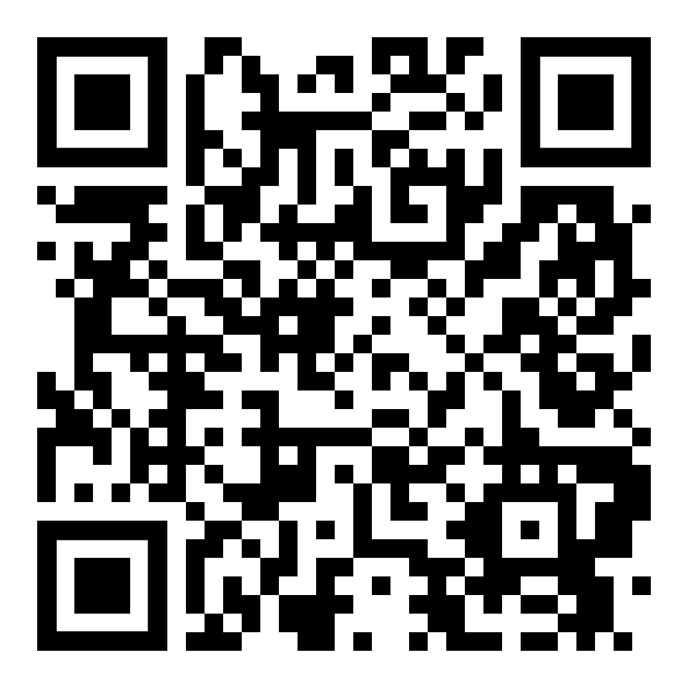

---

    

## Ateliers Électronique

[Capteurs de lumière](./docs/Détecteur_de_lumière/laboratoire.pdf)

 

## Ateliers Arduino

[Clavier à Notes](./docs/clavier_a_notes/laboratoire.pdf) | 
[Solution](./docs/clavier_musical/solution.pdf)

[Entrée de Stationnement](./docs/Entrée_de_stationnement/laboratoire.pdf) |
[Solution](./docs/Entrée_de_stationnement/solution.pdf) |
[Code complet](./docs/Entrée_de_stationnement/code.pdf)

 

## Exercices Arduino

[Entrée Analogue (fr)](./docs/potentiometre/laboratoire_fr.pdf) | 
[Analog Input (en)](./docs/potentiometre/laboratoire_en.pdf)

[Servomoteurs (fr)](./docs/intro_servo/laboratoire_fr.pdf) | 
[Servo motors (en)](./docs/intro_servo/laboratoire_en.pdf) 

[Écran LCD I2C (fr)](./docs/LCD_I2C/laboratoire_fr.pdf) |
[I2C LCD Screen (en)](./docs/LCD_I2C/laboratoire_en.pdf)

[Capteur de Distance HC-SR04 (fr)](./docs/HC-SR04/laboratoire.pdf) |
[Distance Sensor HC-SR04 (en)](./docs/HC-SR04/laboratoire_en.pdf)

[L298 (fr)](./docs/l298/laboratoire.pdf)

 

## Autres

### Modèles STL

[Rover Chassis](./assets/models/rover_chassis.stl)

  
